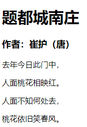

### HTML-超文本标记语言

> 作为WEB前端的基础编程语言，HTML其实是一门标记语言，设计的目的是为了通过HTTP协议进行文档内容传输。最初主要展示的文档内容是表格信息，因而table元素是HTML中比较特殊的元素。HTML中出现的标记被称为元素或标签，比如 a元素或者a标签用于超链接。

#### HTML文档结构

首先需要了解的是HTML文档结构，一个完整的HTML文档包括DTD文档类型声明，必须在第一行。HTML元素，HTML元素内部包含head元素和body元素。head元素内部是描述HTML文档信息的内容，不会显示在页面中。body元素内容是描述页面的内容，会显示在页面中。具体的代码结构如下：

```html
<!DOCTYPE HTML>
<html lang="zh-cn">
  <head>
    <!-- 页面描述信息 -->
    <meta charset="UTF-8"/>
    <title>页面标题</title>
  </head>
  <body>
    <!-- 页面内容 -->
  </body>
<html>
```

#### 标签和元素

HTML的语法是使用标签对文档内容进行标记，从而显示对应的页面效果。标签是指具体的某个标记如：`<a></a>`超链接a元素，标签语法由两个尖括号包裹某个元素，通常有开始和结束标签组成。两个标签之间是页面的内容，如： `<p>我是一个段落内容</p>`表示一段文字内容。元素是指具体表示的页面内容，如：p元素，a与元素等等。

#### 单标签和双标签

在HTML中标签分为**单标签**和**双标签**，单标签由于不需要承载内容所以形如上面代码中的`meta`标签，通常单标签被称为自闭合标签。而双标签中间需要用来承载内容，因此需要开始标签和结束标签形如上面代码中的`html` `head` `title` `body`等。

#### 属性和方法

属性是标签上进行规则设置的方式，属性通常由`属性名="属性值"`构成，常见的属性有id，class，style，而一些其他属性只能在特定的标签上有效。方法是针对页面的用户事件绑定不同的行为，是为了配合javascript语言而产生的，常见的方法有onclick，onchange等。

#### 注释

HTML中的注释如上代码所示通过`<!-- 注释内容 -->`，注释主要是为了对代码进行说明，方便开发人员对代码进行维护，虽然我个人觉得优秀的程序代码不需要注释，但是保持代码注释习惯还是很有必要的。

#### 小案例

通过一个小案例来预览一下HTML文档的页面效果，可直接复制通过记事本或者IDE编译器保存为HTML格式文件，通过浏览器打开查看效果，具体代码如下：

```html
<!DOCTYPE html>
<html lang="zh-cn">
<head>
  <meta charset="UTF-8">
  <title>唐诗三百首</title>
</head>
<body>
  <h1>题都城南庄</h1>
  <h3>作者：崔护（唐）</h3>
  <p>去年今日此门中，</p>
  <p>人面桃花相映红。</p>
  <p>人面不知何处去，</p>
  <p>桃花依旧笑春风。</p>
</body>
</html>
```

页面效果如下：

